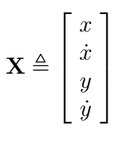
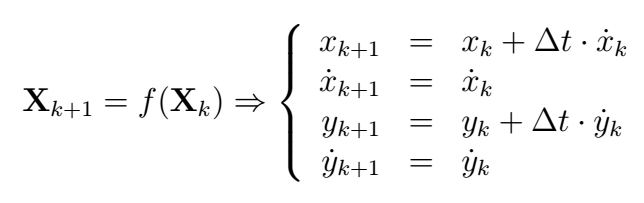
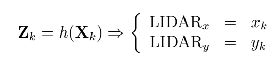
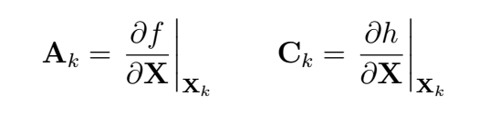

# ECE 6460 Homework #4

The purpose of this assignment is to become familiar with implementing an Extended Kalman Filter (EKF) by using one to process raw segmented objects coming from a 3D LIDAR scan. The goal is to track individual objects through time and infer their velocity relative to the vehicle.

## Due Date
This assignment is due on Sunday, November 17th at midnight.

## Provided Files
- `homework4.launch` that must be modified to complete the assignment
- `homework4_node.cpp`, `Homework4.cpp`, and `Homework4.hpp`, which makes a ROS node wrapper for the EKF that manages spawning new EKF instances and deleting obsolete instances for each object detected in the LIDAR scan. None of these require modification.
- `ObjectEkf.cpp` and `ObjectEkf.hpp`, which implement the core EKF class that will be responsible for tracking the position and velocity of individual objects.
- Dynamic reconfigure configuration file `Homework4.cfg` with the default parameters already set to the proper values. It is encouraged to experiment with the parameter values to see how they affect the system though!
- Rviz display configuration `homework4.rviz` that is already set up to visualize the inputs and outputs of the `homework4` node.
- ROS bag file `homework4.bag` that contains a good dataset for testing the EKF tracking performance:
[OneDrive Link](https://onedrive.live.com/embed?resid=B7FCF91CEE77A2BE%219311&authkey=!AE7EwLblquSXtXs).

## Requirements
Edit the provided `ObjectEkf.cpp` source file to meet the following requirements. See the description of the EKF state space model in the next section for hints on how the algorithm should be implemented. The breakdown of the number of grading points is shown in square brackets.

### 1. Set Up ROS Launch System [10 / 100]
- [3 / 10] Modify `homework4.launch` to run an instance of the `homework4` node.
- [4 / 10] Add a `static_transform_publisher` node instance to `homework4.launch` that defines a TF frame transform from `base_footprint` (parent frame) to `ouster` (child frame).
  - The transformation between base_footprint and ouster is defined by:
	  - Translation: `0.6` x, `0.0` y, `1.5` z
	  - Orientation: `0.00` roll, `-0.04` pitch, `-0.02` yaw
- [3 / 10] Configure ROS to use the time stamp from the bag file by setting the `use_sim_time` parameter.

### 2. Finish the Incomplete EKF Implementation [65 / 100]
Address each of the TODO comments in `ObjectEkf.cpp`:

- [5 / 65] Define the measurement matrix `C`.
- [5 / 65] Compute expected measurement based on `predicted_state`.
- [5 / 65] Compute residual covariance matrix `S`.
- [5 / 65] Compute Kalman gain matrix `K`.
- [5 / 65] Update state estimate vector `X_`.
- [5 / 65] Update estimate covariance matrix `P_`.
- [5 / 65] Implement the state prediction function by propagating the old state vector through the discrete state space equations.
- [5 / 65] Implement the state Jacobian update function by filling in the matrix elements according to the state space model.
- [5 / 65] Implement the estimate covariance prediction function.
- [5 / 65] Properly fill in the elements of the `Q_` matrix in the `setQ` method using the `q_pos` and `q_vel` inputs.
- [5 / 65] Properly fill in the elements of the `R_` matrix in the `setR` method using the `r_pos` input.
- [5 / 65] Populate the `x` and `y` position fields of a `avs_lecture_msgs/TrackedObject` message with the appropriate EKF state vector elements.
- [5 / 65] Populate the `x` and `y` velocity fields of a `avs_lecture_msgs/TrackedObject` message with the appropriate EKF state vector elements.

### 3. Pass Automated Tests [25 / 100]
Open a terminal to the root folder of the ROS workspace and run `tests.bash`. Make sure the automated test script runs and reports that all tests passed.

The test script for Homework 4 runs a series of static unit tests of the `ObjectEkf` class to make sure it is implemented correctly:

- **Instantiation**: Makes sure the class instantiates properly and that the initial state is properly extracted using the `getEstimate` method.
- **Q and R**: Tests the `setQ` and `setR` methods to properly populate the process and measurement noise covariance matrices.
- **State Prediction**: Tests the `statePrediction` method by inputting multiple state vectors and ensuring the predicted output state vector matches what is expected according to the EKF's state space model.
- **State Jacobian**: Tests the `stateJacobian` method by inputting multiple state vectors and making sure the Jacobian matrix output matches what is expected.
- **Covariance Prediction**: Tests the `covPrediction` method by inputting multiple `A`, `Q` and past covariance matrices, and making sure the predicted output matrix matches what is expected.
- **Update Filter**: Tests the `updateFilterMeasurement` method by inputting past states and estimate covariances, along with a new object position measurement, and making sure the new state estimate and covariance match what is expected.

## EKF State Space Model
### State vector definition
Because we're interested in tracking both the position and velocity of the LIDAR objects, the EKF model has four states: the individual x and y components of position and velocity:

### Discrete state space model equations
The state dynamics of the EKF assume the object will move freely in both x and y. Therefore, the discrete state equation is:

The raw objects being input from the point cloud segmentation algorithm provide measurements of the x and y position, so the measurement equation for the state space model is:

### Process and measurement noise parameters
The dynamic reconfigure GUI parameters for the EKF algorithm are:

- `q_pos`: Standard deviation of the position states
- `q_vel`: Standard deviation of the velocity states
- `r_pos`: Standard deviation of the position measurements

The Q and R matrices of the EKF are populated with these parameters in the `setQ()` and `setR()` methods of the `ObjectEkf` class.

### State and measurement Jacobians
The A and C matrices that are used in the EKF algorithm are computed from the state and measurement equations, respectively:

## Testing Locally
After making the required changes, test your EKF implementation locally on your PC before running the automated test script:

- Download `homework4.bag` from the link shown in the Provided Files section of these instructions.
- Run `homework4.launch` to start up the software and visualize the tracking outputs in Rviz and how they compare to the reference implementation.
- Run the bag file manually on the command line to test your Homework 4 node
- Play around with the Kalman filter parameters to see how they affect the system.
